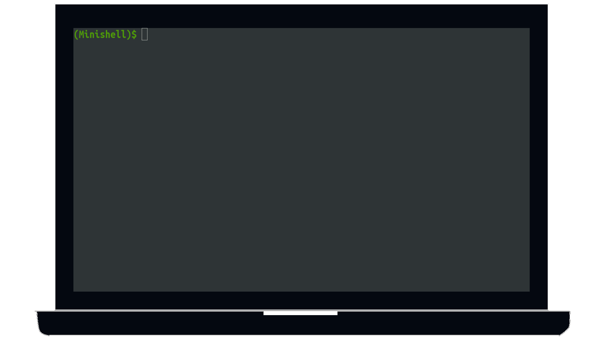
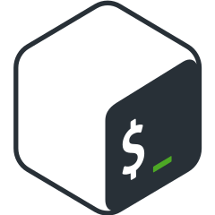
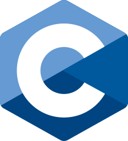

### hi.

[<picture><source media="(prefers-color-scheme: dark)" srcset=".github/assets/images/readme-light.png"/></picture>](https://github.com/BrunoCostaGH/42cursus-minishell)
**I'm Bruno!** I was born and raised in **Funchal, Madeira**, but I recently moved to **Porto** to chase my dream of becoming a software developer. I am currently a student at **42 Porto**, a peer-to-peer computer programming school. 

We learn by completing projects, mainly in **C and C++**. The projects range from recreating simple real-world functions to rebuilding a mini version of the bash terminal, creating a web server, or even completing full-stack projects like creating a website from scratch with various features.

I am excited to continue learning and exploring this field, and I can't wait for my next challenge.

) ) 
   

[<picture><source media="(prefers-color-scheme: dark)" srcset="https://github-readme-stats.vercel.app/api/pin/?username=BrunoCostaGH&repo=42cursus-minishell&hide_border=true"/>](https://github.com/BrunoCostaGH/42cursus-minishell)
[<picture><source media="(prefers-color-scheme: dark)" srcset="https://github-readme-stats.vercel.app/api/top-langs/?username=BrunoCostaGH&layout=compact&card_width=420&hide_border=true"/>](https://github.com/BrunoCostaGH?tab=repositories)
