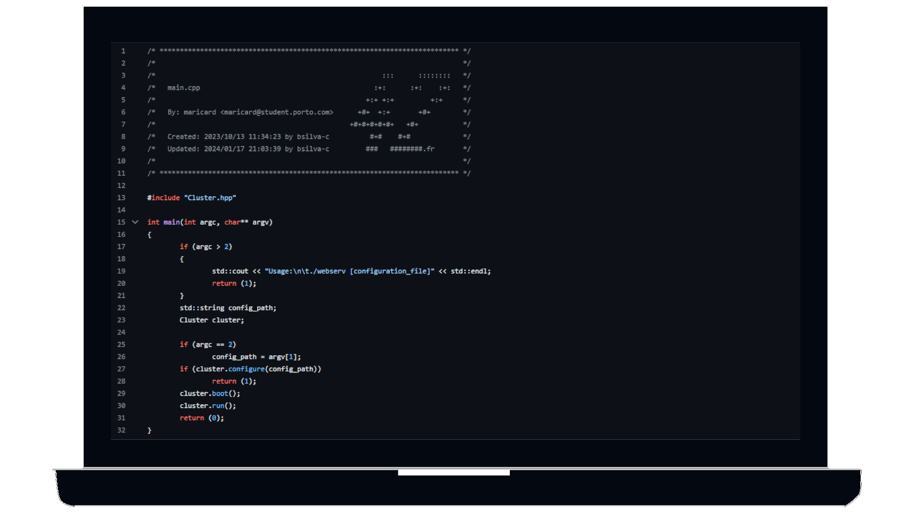

### Hi.

[<picture><source media="(prefers-color-scheme: dark)" srcset=".github/assets/images/readme-light.png"/></picture>](https://github.com/BrunoCostaGH/42cursus-minishell)
<b>I</b> <b>a</b>m <b>curre</b>ntly <b>a</b> <b>stud</b>ent <b>a</b>t <b>42</b>, <b>a</b> <b>comp</b>uter <b>progra</b>mming <b>sch</b>ool <b>th</b>at <b>empha</b>sizes <b>peer-t</b>o-peer <b>learn</b>ing. <b>Collabo</b>rative <b>problem-</b>solving <b>i</b>s <b>somet</b>hing <b>I</b> <b>val</b>ue <b>grea</b>tly, <b>an</b>d <b>I</b> <b>ha</b>ve <b>be</b>en <b>equi</b>pped <b>wi</b>th <b>th</b>e <b>neces</b>sary <b>ski</b>lls <b>t</b>o <b>tac</b>kle <b>ev</b>en <b>th</b>e <b>mo</b>st <b>challe</b>nging <b>obsta</b>cles. <b>Wi</b>th <b>m</b>y <b>rigo</b>rous <b>curric</b>ulum, <b>I</b> <b>beli</b>eve <b>I</b> <b>a</b>m <b>a</b> <b>hig</b>hly <b>sought</b>-after <b>candi</b>date <b>i</b>n <b>th</b>e <b>jo</b>b <b>mark</b>et. <b>I</b> <b>a</b>m <b>eag</b>er <b>t</b>o <b>embr</b>ace <b>ne</b>w <b>opportu</b>nities <b>an</b>d <b>wo</b>rk <b>ha</b>rd <b>t</b>o <b>achi</b>eve <b>m</b>y <b>goa</b>ls. <b>Th</b>e <b>fut</b>ure <b>loo</b>ks <b>brig</b>ht, <b>an</b>d <b>I</b> <b>a</b>m <b>exci</b>ted <b>t</b>o <b>se</b>e <b>wh</b>at <b>i</b>t <b>hol</b>ds!

  
   

[<picture><source media="(prefers-color-scheme: dark)" srcset="https://github-readme-stats.vercel.app/api/pin/?username=BrunoCostaGH&repo=42cursus-minishell&hide_border=true"/>](https://github.com/BrunoCostaGH/42cursus-minishell)
[<picture><source media="(prefers-color-scheme: dark)" srcset="https://github-readme-stats.vercel.app/api/top-langs/?username=BrunoCostaGH&layout=compact&card_width=450&hide_border=true"/>](https://github.com/BrunoCostaGH?tab=repositories)
